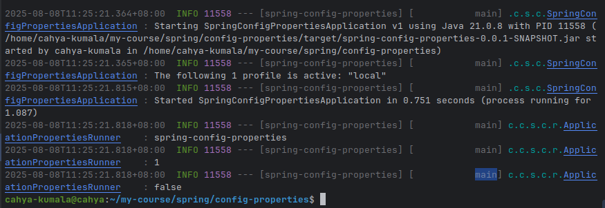
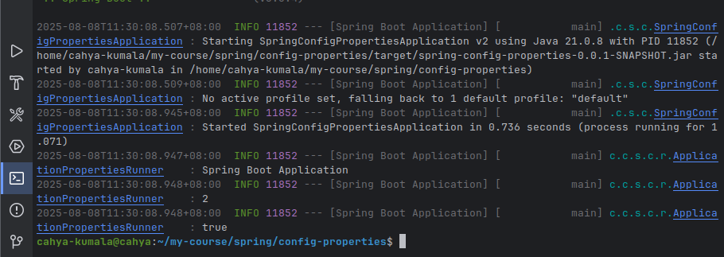
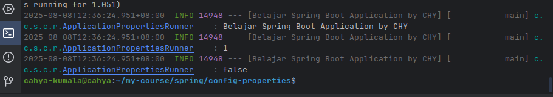
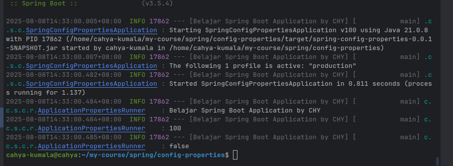

# Spring Configuration Properties Section-2.

#

Some url:

1. https://docs.google.com/presentation/d/16ySkTMfFaz4npehRXFk_6zj6BlZUvGFON5fMIKSR2W8/edit?usp=sharing

## Resource

```
Resource adalah bagian untuk mengakses file atau resource lain yang ada di dalam classpath atau filesystem. 
Resource dapat berupa file, URL, atau input stream.
Caranya gunakan class turunan dari `org.springframework.core.io.Resource` seperti `FileSystemResource`, 
`ClassPathResource`, atau `UrlResource`.
```

> > Contoh: pada class ResourceTest
> > ClassPathResource untuk mencari file yang ada di dalam project kita.
> > Resource diperlukan saat melakukan config properties untuk menentukan lokasi file yang akan digunakan.

## Resource Loader

```
Resousrce Loader digunakan untuk mengambil data secara otomatis tanpa membuat object resourcenya.
Caranya menambagkan prefixnya, misal:
1. classpath:/com/pzn/application.properties
2. file:/home/pzn/application.properties
3. url:http://localhost:8080/application.properties

Keterangan:
1. classpath: untuk mengambil file dari classpath.
2. file: untuk mengambil file dari filesystem.
3. url: untuk mengambil file dari URL.
```

> Pertanyaan: Resource loader adalah sebuah interface, sehingga kita perlu mengimplementasikannya.
> Jawaban: Tidak perlu, karena Spring sudah menyediakan implementasi dari Resource Loader.
> Seperti applicationContext adalah turunan dari Resource Loader.
>> Contoh: pada package resourceloader -> class ResourceLoaderTest
> > file yang diambil adalah resource.txt dalam folder text.

## Message Source

```
- Pada Java dapat mengambil data dengan menggunakan properties (udemy-section1).
- Dalam Spring GUNAKAN fitur Message Source untuk mengambil message dari resource.
- JADI lokasinya tetap menggunakan resource.

Message Source adalah sebuah interface, untuk menggunakannya kita perlu implementasi class-nya.
UTUNGNYA Spring sudah menyediakan implementasi dari Message Source, yaitu `ResourceBundleMessageSource`.
JADI kita tidak perlu membuatnya secara manual (mengimplementasikan sendiri).
```

> > Contoh: Kita akan membuat file my.properties di dalam folder resources.
> > Misalnya buat file yang bahasa indonesia my in ID.properties
> > Kemudian coba dengan messageSourcenya pada package messagesource -> class MessageSourceTest
>>> Caranya:
> > 1. Buat file `my.properties` di dalam folder resources.
> > 2. Buat file `my_id.properties` untuk bahasa Indonesia.

## Spring Boot Message Source

```
- Pada spring boot tidak perlu membuat Message Source secara manual.
- Secara default Spring Boot akan membuat Message Source dengan mengambil data resource dari file
  `messages.properties` yang ada di dalam classpath. (Jadi sebelumnya kan manual pakai my.properties).
 - Untuk mendapatkan Message Source kita juga dapat menggunakan MessageSourceAware.
```

> Caranya:
> Format: `messages_{locale}.properties`
> > 1. Buat file `messages.properties` di dalam folder resources.
> > 2. Buat file `messages_id.properties` untuk bahasa Indonesia.
>>> Contoh: Kemudian coba gunakan messageSourcenya.
> > > pada package springbootmessagesource -> class SpringBootMessageSourceTest

## Application Properties

```
Jika membuat project Spring menggunakan start.spring.io, otomatis terdapat file `application.properties`.
File ini adalah pusat konfigurasi untuk aplikasi Spring Boot.
```

> Dalam file `application.properties`  dapat membuat konfigurasi apapun contoh:
> application.name=Belajar Spring Boot

> Bagiamana cara mengaksesnya?
> 1. Cara paling sederhana => menggunakan Environment.
> > Contoh: pada package appproperties -> class ApplicationPropertiesTest

## Environment

```
- Environment digunakan untuk mengakses data di dalam Application Properties.
- TETAPI Ecnvironment dapat digunakan untuk mengakses data 
environtment variable pada sistem operasi.
- EnvirontmentAware dapat digunakan untuk mendapatkan object Environment.
```

> > Contoh: pada package environment (test)-> class EnvironmentTest
> > running di terminal: env | grep JAVA_HOME, ini hasilnya masih null
> > untuk tau java homenya bisa running: readlink -f $(which java) pada terminal

## Annotation @Value

```
- Annotation @Value digunakan untuk melakukan inject dari properties ke field yang kita tandai.
- Jadi ini digunakan untuk mengambil data dari Application Properties.
- Cara yakni:
  menggunakan kode ${nama.properties.nya}
  Secara otomatis akan diambil valuenya, dan langsung melakukan konversi juga.
```

> > Contohnya:
> > update application.properties: application.name, application.version, dan application.production-mode
> > Kemudian new package value -> class ValueTest

```
Selain untuk mengambil data dari Application Properties,
@Value juga digunakan untuk mengambil data dari system properties atau environment variable.
Contohnya untuk mengambil data dari environment variable JAVA_HOME, juga ada pada class ValueTest.
```

## Properties Source

```
Secara default, application properties hanya akan mengambil dari file application.properties yang ada di dalam classpath.
```

> > Tapi bagaimana jika kita ingin mengambil dari file lain?
> > Contoh: menambahkan sample.properties di dalam folder resources.
> > Cara mengambilnya:
> > Tambahkan @PropertySource pada class yang akan mengambil data dari file tersebut.
> > Kemudian buat new package propertiessource -> class PropertySourceTest

## Test Properties Source

```
Saat membuat unit test, kadang kita ingin mengakses properties file yang berbeda untuk mencoba skenario yang berbeda.
Ini akan sulit jika menggunakan @PropertySource.
JADI kita dapat menggunakan @TestPropertySource.
```

> > Contoh: membuat properties di folder test, jadi bukan di main resources.
> > 1. Buat folder resources di dalam folder test.
> > 2. Buat file test.properties di dalam folder resources.
> > 3. Buat package baru testpropertysource -> class TestPropertySourceTest
> > 3. Kemudian pakai @TestPropertySource pada class yang akan mengakses file tersebut.
> > 4. Ini pada class TestApplication

## Profile

```
- Profile adalah fitur untuk menentukan COMPONENT mana yang mau jalan.
- Profile cocok ketika butuh component berbeda pada kondisi tertentu, misalnya:
  Membuat component untuk koneksi ke Memory Database, tapi jika di Local misal, kita ingin
  componentnya diganti dengan koneksi di memory aplikasi saja.
- Untuk menandai sebuah komponen dengan informasi profile, kita dapat menggunakan annotation @Profile.
``` 

> > Contohnya: tambahkan pada application.properties
> > spring.profiles.active=local
> > JIKA mau lebih dari 1 tinggal tambahkan koma, misal: spring.profiles.active=local, dev, test

#### Profile Properties

```
- Untuk menentukan profile mana yang akan berjalan, kita bisa menentukan di application.properties]
  dengan menggunakan key spring.profiles.active.
- Dimana kita bisa menentukan active profile lebih dari satu.
```

> > Contoh: pada application.properties tambahkan spring.profiles.active=local
> > Kemudian saat membuat @Component, kita bisa menambahkan annotation @Profile("local").
> > pada class ProfileTest di package profile.

#### Active Profile annotation

```
- Mengubah profile di application properties akan menyulitkan ketika membuat unit test untuk BEBERAPA profile.
- Untuk mengubah profile di unit test, kita bisa menggunakan annotation ActiveProfiles.
- JADI Aktif Profile bise digunakan untuk mengubah-ubah profile yang saat ini di jalankan.

KESIMPULAN:
profile bisa lebih dari satu, jadi bisa mengaktifkan beberapa profile sekaligus.
```

> > Contoh: pada package profile -> class ProfileTest (paling atas).

#### Profile di Environment

```
- Untuk mendapatkan profile pada saat aplikasi berjalan, 
  kita bisa menggunakan Environment.
- Dalam environment terdapat method getActiveProfiles() untuk mendapatkan profile yang aktif.
```

> > Contoh: pada package profileenvironment -> class ProfileEnvironmentTest

## Profile Properties File

```
- Dengan fitur profile, kita bisa membuat file properties yang sesuai dengan profile yang aktif.
- Penamaan properties file adalah application-{profile}.properties.
- Misal active profile adalah dev, maka application-dev.properties akan digunakan.
```

> > Contoh: pada folder main -> resources buat file:
> > 1. application-production.properties
> > 2. application-test.properties
       > > Misalnya akan membuat beberapa profile, misalnya default, production, dan test.
       > > Jadi tambahkan profile.default pada application.properties
       > > Buat komponen, pada folder test -> package profileproperties -> class ProfilePropertiesTest

## Configuration Properties

```
- Fitur ini bisa digunakan untuk melakukan binding secara otomatis key yang ada di 
  application.properties ke Java Bean property secara otomatis.
- Binding adalah proses menghubungkan data dari file properties ke dalam Java Bean, 
  atau menyamakan data dari file properties ke dalam Java Bean.
- Tapi untuk menggunakan fitur ini, kita perlu menambahkan dependency 
  spring-boot-configuration-processor pada file pom.xml.

CARANYA:
- Untuk menandai Java Bean agar otomatis di binding ke Application Properties,
  kita bisa menggunakan annotation @ConfigurationProperties.
- Kemudian perlu menambahkan prefix untuk key di application.propertiesnya.
```

> > Contoh: Class ApplicationProperties pada package properties -> main.
> > Tapi @ConfigurationProperties tidak akan bekerja jika tidak ada prefixnya dan tidak otomatis melakukan binding.
> > Jadi perlu membuat metadata untuk bindingnya. Cara run di terminal: mvn clean compile.
> > Kemudian cek di target/classes/META-INF/spring-configuration-metadata.json
> > Tapi untuk menjalankannya,
> > kita perlu menambahkan annotation @EnableConfigurationProperties pada class yang akan menggunakan binding.
> > Contoh: pada folder test -> package configurationproperties -> class ConfigurationPropertiesTest

> > > Jadi nanti bisa pakai semua properties yang ada di spring-configuration-metadata.json

## Complex Configuration Properties

```
- Configuration Properties mendukung Java Bean yang kompleks.
- Misalnya yang berisikan Java Bean object lain.
- Ini memungkinkan pembuatan Configuration properties menjadi lebih mudah,
  karena tidak perlu dilakukan secara manual.
```

> Misalnya kita memiliki DatabaseProperties yang memiliki object kompleks.
> Kita coba:
> > 1. Buat class DatabaseProperties, saya gabung 1 file saja di class ApplicationProperties -> package properties ->
       main.
> > 2. Jadi ini perlu di compile ulang, karena ada perubahan di class ApplicationProperties => run = mvn clean compile.
> > 3. Kemudian cek di target/classes/META-INF/spring-configuration-metadata.json
> > 4. Kemudian tambahkan pada apllication.properties, untuk databasenya:
       > > meliputi password, username, dan url.
> > 5. Kemudian update unit testnya di class ConfigurationPropertiesTest

## Collection Configuration Properties

```
- Mendukung binding properties untuk jenis collection seperti List atau Map.
- Ini cocok untuk data yang sangat komples, bisa Collection yang berisis data sederhana,
  atau collection yang berisi Java Bean lagi.
```

> > > Contoh: Tambahkan pada class ApplicationProperties:
> > 1. Tambahkan collection List<String> untuk list of string.
> > 2. Tambahkan collection Map<String, String> untuk map of string.
> > 3. Kemudian run mvn clean compile.
> > 4. Tambahkan pada application.properties.
> > 5. Lakukan unit test pada class ConfigurationPropertiesTest.

## Embedded Collection

```
- Configuration Properties juga mendukung jika kita membuat Java Bean di dalam collection.
```

> > Contoh:
> > 1. pada class ApplicationProperties.
> > 2. Run mvn clean compile.
> > 3. tambahkan pada application.properties.
> > 4. buat unit test pada class ConfigurationPropertiesTest.

## Conversion

```
- Saat menggunakan Configuration Properties, BAGAIMANA Spring 
melakukan konversi data yang ada di properties file ke tipe data di Java?
- JAWABAN: Spring memiliki mekanisme konversi tipe data.
- Secara default, semua tipe data yang ada di Java sudah didukung oleh Spring.
- TAPI bagaimana jika kita ingin membuat tipe data sendiri?
- JAWABAN: kita bisa membuat class Conversion sendiri.

Sebenarnya Spring sudah menyediakan class Conversion sendiri.
Jadi bisa lihat class turunan dari `Converter` atau `GenericConverter`.
```

> > Contoh 1: TIPE data ke String.
> Ingin menambahkan Duration di class ApplicationProperties.
> Bagaimana cara melakukan konversi dari Duration ke String?
> > 1. Di class ApplicationProperties, tambahkan konfigurasi untuk Duration.
> > 2. Bagiamana pada application.properties-nya?
> > 3. Caranya compile dulu, tambahan dari class ApplicationProperties (run mvn compile).
> > 4. Ubah pada application.properties, gunakan class bawaan SpringToDurationConverter.
       > > Cara: tekan CTRT+ShIFT+N -> search di tab class -> SpringToDurationConverter.
> > 5. Kemudian download aja soruce code-nya, atau copy paste aja.
> > 6. sehingga pada Application.properties: tinggal anggka di depan, durasinya menit kah, detik kah:
       > > spring.application.default-timeout=10s
> > 7. Kemudian update unit test pada class ConfigurationPropertiesTest.

> > Contoh 2: TIPE data Custom.
> > Misal membuat tipe data String ke Date.
> > 1. Buat class converter -> class StringToDateConverter -> pada package converter di main.
> > 2. Tambahkan expiredDate pada class ApplicationProperties.
> > 3. Run mvn clean compile.
> > 4. Tambahkan pada application.properties
> > 5. Buat unit test pada class ConfigurationPropertiesTest.
       > > Berkaitan dengan Conversion Service.

## Conversion Service

```
- Conversion Service adalah inti dari logic untuk melakukan konversi tipe data di Spring.
- Saat membuat custom converter, kita harus registrasikan ke conversion service.
- Kita bisa mengimplementasikan class ApplicationConversionService.
Tapi kali ini akan dibuat manual dulu.
```

> > Lanjutkan contoh sebelumnya:
> > Buat bean method pada ConfigurationPropertiesTest, yang bernama ConversionService.

#### Menggunakan Conversion Service

```
Conversion Service selain bisa digunakan untuk melaklukan konversi tipe data otomatis,
ketika menggunakan config properties, kita bisa gunakan secara PROGRAMMATICALLY untuk melakukan konversi tipe data.
CARA: ambil object ConversionService lalu panggil langsung methodnya.
```

> > Contoh:
> Misal ingin mengubah 10s String menuju duration.
> > 1. inject ConversionService pada class ConfigurationPropertiesTest.
> > 2. Buat testConversionService

## Externalized Properties File - Mengganti Konfigurasi dari luar jar

```
- Saat Aplikasi Spring Boot sudah selesai, semua config properties akan dibungkus di dalam jar file.
- BAGAIMANA jika kita ingin mengubah isi informasi nya?
- Misal konfigurasi database tidak mungkin kita simpan di dalam kode program.
- Ada beberapa cara untuk menggunakan configuration dari luar aplikasi, ketika sudah menjadi file jar.
```

##### Caranya:

> 1. Membuat application.properties di luar jar.
>
> Walaupun sudah ada di dalam jar, kita bisa membuat file application.properties di luar jar.
> Lalu ketika menjalankan aplikasi jar Spring Boot, kita bisa menyebutkan lokasi application.properties nya.
> DENGAN perintah: java -jar lokasi/file.jar --spring.config.location=lokasi/file/application.properties.
> JADI ini akan mereplace file application.properties yang ada di dalam jar.

> > Contoh: Membuat program sederhana, yang hanya menampilkan isi dari ApplicationProperties.
> 1. Buat new package di main -> namanya runner -> ApplicationPropertiesRunner
> 2. Lalu update di class SpringConfigurationPropertiesApplication.
> 3. Kemudian langsung test runing main class-nya.
> 4. Next Buat file external.properties di luar jar, misal di folder config-properties.
> 5. Kemudian compile, buka terminal, lalu running: mvn compile pacakage
> 6. Package itu untuk membuat file jar.
> 7. Cek di dalam target, ada file jar-nya.
     
>
> 8. Kemudian jalankan secara manual di terminal tanpa configurasi:
     > cara: java -jar target/spring-config-properties-0.0.1-SNAPSHOT.jar
     > Hasilnya masih mengambil dari application.properties yang ada di dalam jar.
     > 
> 9. Kemudian running:
     > TAMBAHAN saat running --spring.config.location=external.properties, sebagai berikut:
     > java -jar target/spring-config-properties-0.0.1-SNAPSHOT.jar --spring.config.location=external.properties
     > Untuk mengambil file external.properties yang ada di luar jar, jadi replace file application.properties yang ada
     di dalam jar.
     > Hasilnya, dimana version 2 dan true sesuai dengan external.properties:
     > 

## Environment Variable

```
- Saat menggunakan external.properties file,
  properties file yang ada di dalam Jar tidak akan digunakan.
  Karena sudah di replaca pada contoh di atas.
- Hal ini menyebabkan kita harus menulis ulang semua propertis key yang ada di properties file,
 dan kadang jika isinya terlalu banyak, akan sangat menyulitkan.
- Spring Boot juga mendukung mengambil properties dari environment variable.
- Hal ini membuat kita lebih mudah, karena tidak harus semua properties dibuat ulang di file external.properties.
- CUKUP yang dibutuhkan saja.
- Selain itu, kita bisa membuat default value ketika environtment variablenya tidak ada.
```

> > Contoh:
> Ubah dalam application.properties:
> > Tambahkan spring.application.name=${APPLICATION_NAME:Belajar Spring Boot}
> > Kalau test running hasilnya akan tetap sama, ini run dari main class SpringConfigurationPropertiesApplication.
> > Karena belum ada environment variable APPLICATION_NAME, APPLICATION_VERSION, dan APPLICATION_PRODUCTION_MODE.
> > Kemudian package ulang, run diterminal: mvn clean package.
> > Kemudian coba jalankan lagi di terminal:
> > > java -jar target/spring-config-properties-0.0.1-SNAPSHOT.jar
> > Hasilnya tetap version 1 dan false.
> > > APA yang terjadi jika membuat environment variable?
> > JADI ketika menjalankan cukup running ini di terminal:
> >>> export APPLICATION_NAME="Belajar Spring Boot Application by CHY"
> > > > export APPLICATION_VERSION="2"
> > > > export APPLICATION_PRODUCTION_MODE="false"
> > > Kemuduian running lagi:
> > > java -jar target/spring-config-properties-0.0.1-SNAPSHOT.jar

```
Kesimpulan cukup dengan environment variable kita dapat mengubah detailnya.
```

> Lihat hasilnya menjadi CHY, karena yang saya ubah hanya name nya,
> Jika ingin mengubah version dll caranya seperti di atas.
> > 

## Mengubah Profile

```
- Selain mengubah active profile menggunakan application properties,
  kita juga bisa menggubnakan cammand line argument untuk mengubah acative profile.
- Gunakan argumen:
    --spring.profiles.active=first, second, third.
```

> Contoh:
> Running di terminal, jarnya dulu, kemudian argumen di atas, sebagai berikut:
> > java -jar target/spring-config-properties-0.0.1-SNAPSHOT.jar --spring.profiles.active=production
> JIKA ingin lebih dari satu profile, tinggal tambahkan koma, misal:
> > > java -jar target/spring-config-properties-0.0.1-SNAPSHOT.jar --spring.profiles.active=production,local,test
> > Jadi cara ini tidak perlu mengubah file application.properties.
> Result:
> 